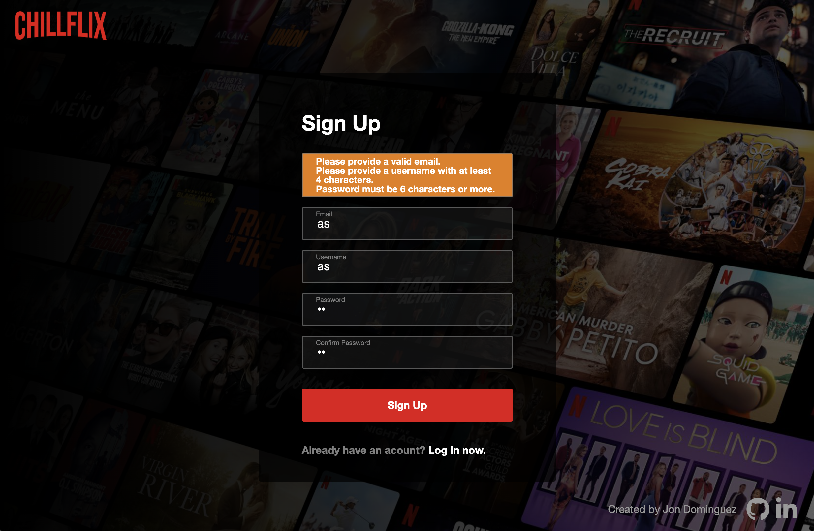
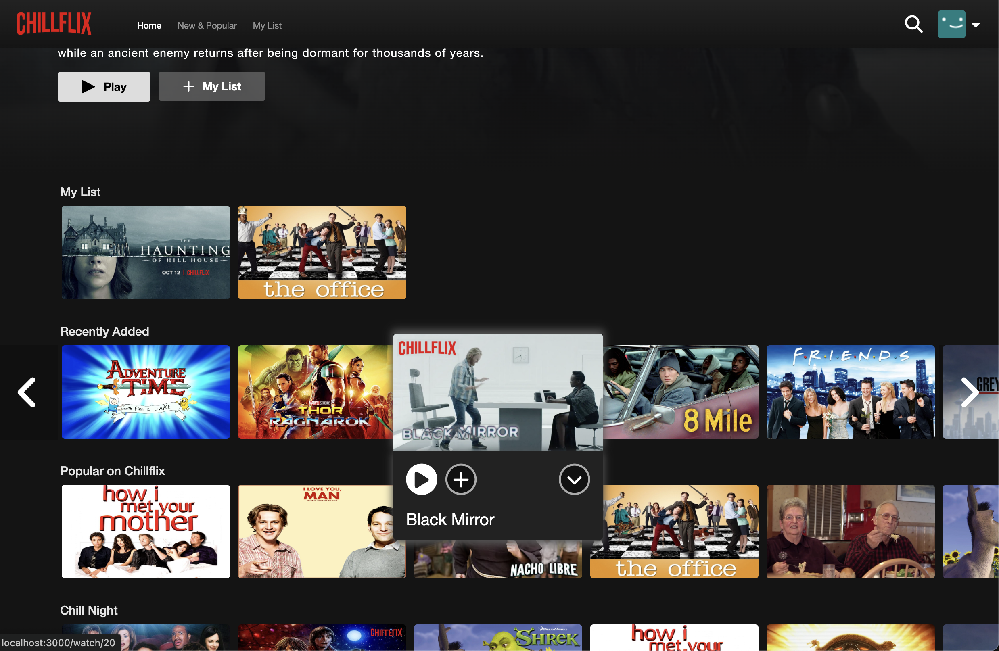
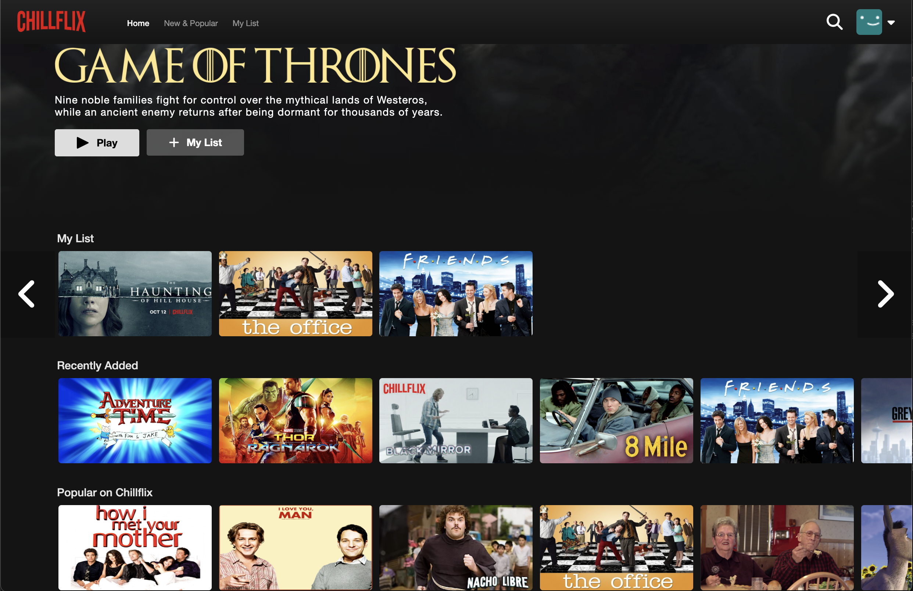
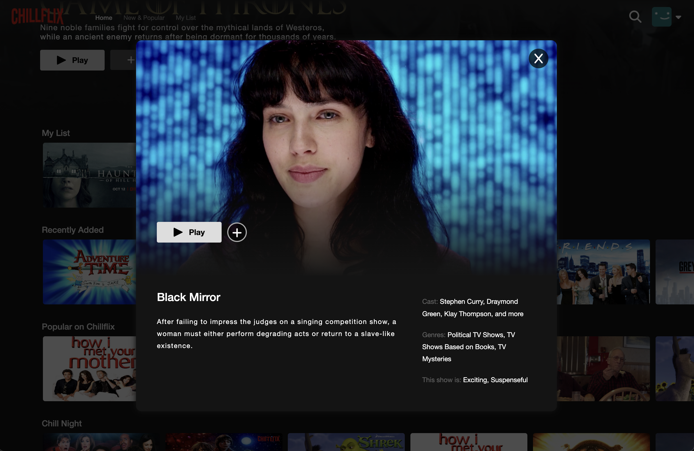
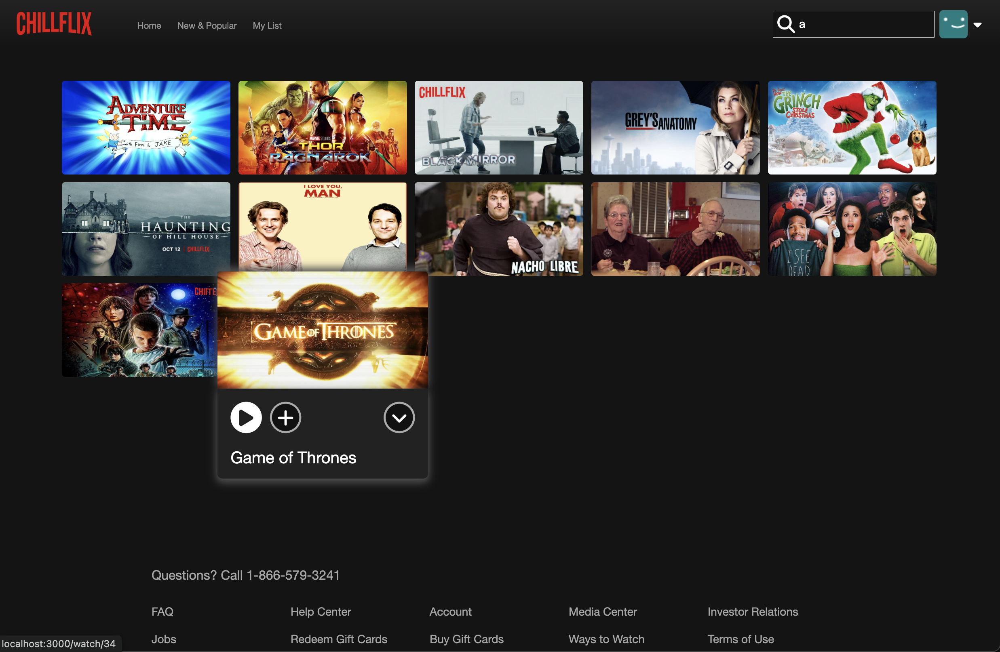
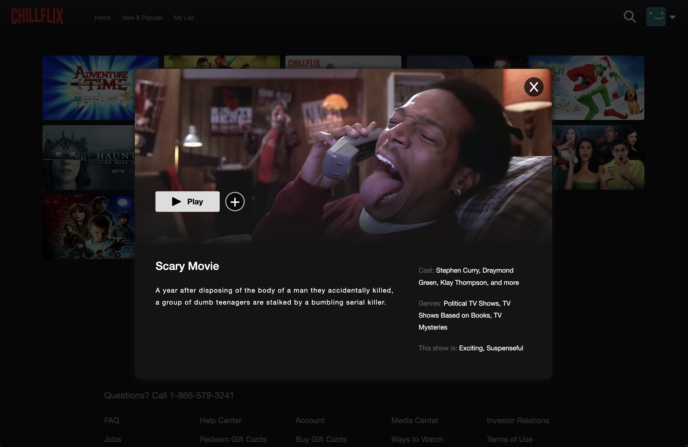

# Table of Contents
- [Background and Overview](#background-and-overview)
  - [Demo](#demo)
- [Technologies](#technologies)
- [Site](#site)
  - [Splash Page](#splash-page)
  - [Videos](#videos)
  - [My List](#my-list)
  - [Info](#info)
- [Feature Highlights](#feature-highlights)
  - [Video Search](#video-search)
  - [Info and Dropdown Effects](#video-info-modal-and-effects)

## Background and Overview

Chillflix Revamp is a modernized and refactored implementation of my previous Chillflix project done in 2020.

Some key changes include:
* Using an Express backend instead of Ruby on Rails
* Upgrading to React 19 making use of hooks instead of lifecycle methods from React 16
* Utilizing my gained knowledge from work experience to refactor HTML, CSS, and JavaScript
* Simplifying the overall code to make it more efficient and readable
* Modernizing the UI to more closely match that of the current Netflix UI
* Making the entire app truly responsive
  * Content dependent on screen size
  * Support for touch screens


Chillflix is a clone of the video-streaming site, Netflix. On this site, users are able to create new accounts and login and watch short clips of popular movies and shows.

Features cloned from Netflix include:
* User authentication
* Featured video preview
* Video categories
* Infinite scroll wheel
* Video controls on hover
* Video info popup
* My List
* Search functionality
* Video playback

## Demo
[Live Link](https://flix-n-chill.herokuapp.com/#/)

## Technologies

Chillflix Revamp was built on an `Express` backend with a `React/Redux` front end. User data such as login and list information was stored in a `PostgreSQL` database. Videos and thumbnails were stored and accessed through `AWS S3`.

## Site

### Splash Page

The Chillflix splash page/auth is an exact clone of the Netflix. It features the same background, fonts, and effects. The user auth forms have the same shrink effects and colors/errors match.




### Videos

Chillflix videos are featured on scroll wheels according to their categories. Scroll wheels feature infinite scroll. Upon hovering over a single video, controls for that video appear. The controls include a play button, an add to my list button, and an expand button.



### My List

Users can add videos to their watch list with the click of a button. The button exists everywhere a link to the movie exists. Upon clicking, the association will be updated on the backend and the button icon will update as needed. The sections displaying the user's list will also update in real time



### Info

When the expand button is clicked, a modal for the video shoes up. The modal plays a preview of the clip at the top. Overlaying the video are the play button which takes the user to the fullscreen video and the add-to-my-list button. Below the buttons are the title and description of the video. Next to that is dummy meta-data to match the look of Netflix.
To close the modal, the user may click the close button on the top right of the modal or anywhere outside of the modal.



## Feature Highlights

### Video Search

In my original Chillflix project, implementing the search functionality was quite a challenge. I had to come up with a clever way to split responsibilites among components. But in this revamp, it is much more simplified.

The searchbar exists on the Navbar and updates the query string as needed. If the user closes the search bar without a query, the app will reroute to the home page.

Instead of relying on any passed-in props, the search results page uses the `useLocation` hook and the `Redux store` to filter and return results. Then it reuses the same components as the home page to display the resulting movies.



```
// Search/index.js


const SearchPage = () => {
    const location = useLocation();
    const movies = useSelector(state => state.movies);

    const [filteredMovies, setFilteredMovies ] = useState([]);

    useEffect(() => {
        const queryString = decodeURIComponent(location.search)
                            .split('?=')[1].toLowerCase();

        setFilteredMovies(
            !queryString ?
                []
            :
                Object.values(movies).filter(movie => movie.title.toLowerCase().includes(queryString))
        );
    }, [location]);

    // ...
```

### Video Info Modal and Effects

When a movie's expand button is clicked, a modal is supposed to popup with an updated URL. The modal plays a preview of the movie, displays control buttons, and lists info about the movie.

This was updated from the original iteration of individual dropdowns which was a challenge to implement.

To display the modal on top of the existing content without changing routes, I utilized the `useContext` hook and `React.createPortal` method.
* I created a modal context and a `Provider` for that context. The provider held a `div` to be rendered separately from it's `children`. This Provider was wrapped around the entire app.
* Then I created a `Modal` functional component that returns a call to `React.createPortal()` passing in any `children` props and the modal context
* The `children` are then rendered within the modal context provider's separate `div` using `CSS` to position it on top of the content
* This `Modal` functional component was called from the browse page's video carousels and all the display pages to show the video info popup as a modal on top of whichever page called it




```
// Modal.js

const ModalContext = createContext();

export const ModalProvider = ({children}) => {
    const modalRef = useRef();
    const [value, setValue] = useState();

    useEffect(() => {
        setValue(modalRef.current)
    }, []);

    return (
        <>
            <ModalContext.Provider value={value}>
                {children}
            </ModalContext.Provider>
            <div ref={modalRef}></div>
        </>
    )
}

export const Modal = ({ onClose, children }) => {
    const modalNode = useContext(ModalContext);
    if (!modalNode) return null;

    return ReactDOM.createPortal(
        <div id="modal">
            <div id="modal-background" onClick={onClose}></div>
            <div id="modal-content">
                {children}
            </div>
        </div>,
        modalNode
    )
}
```
```
// SpinnerItem.js

const SpinnerItem = ({movie}) => {
    // ...
    const [ showModal, setShowModal ] = useState(false);

    function expand() {
        const extraString = location.pathname === '/browse' ? `#jbv=${movie.id}` : `${location.search}#jbv=${movie.id}`;
        navigate(`${location.pathname}${extraString}`);
        setShowModal(true);
    }

    function collapse() {
        setShowModal(false);
        const extraString = location.pathname === '/browse' ? '' : location.search;
        navigate(`${location.pathname}${extraString}`);
    }

    return (
        <>
            <div className="spinner-item enlarge">

                // ...

                    <p className="center-flex round-button expand-btn" onClick={expand} >
                        <i className="fa fa-angle-down"></i>
                    </p>

                // ...

                {showModal && (
                    <Modal onClose={collapse}>
                        <Preview sessionUser={sessionUser} movie={movie} onList={onList} onClose={collapse} />
                    </Modal>
                )}
            </div>
        </>
    );
}
```


[Back to Top](#)
